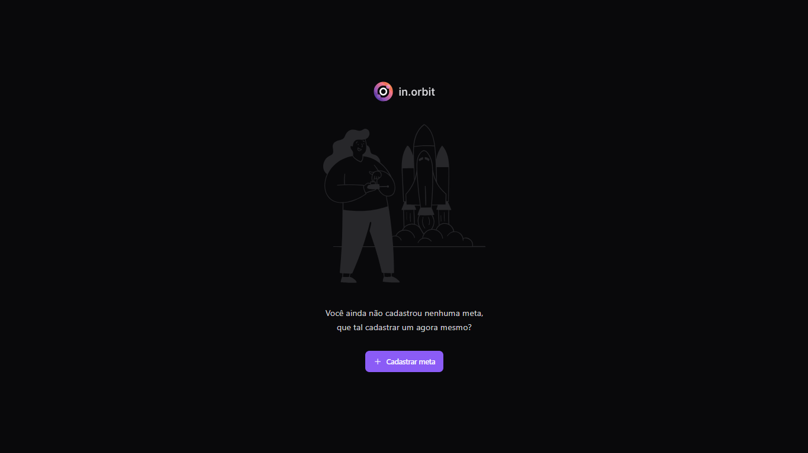
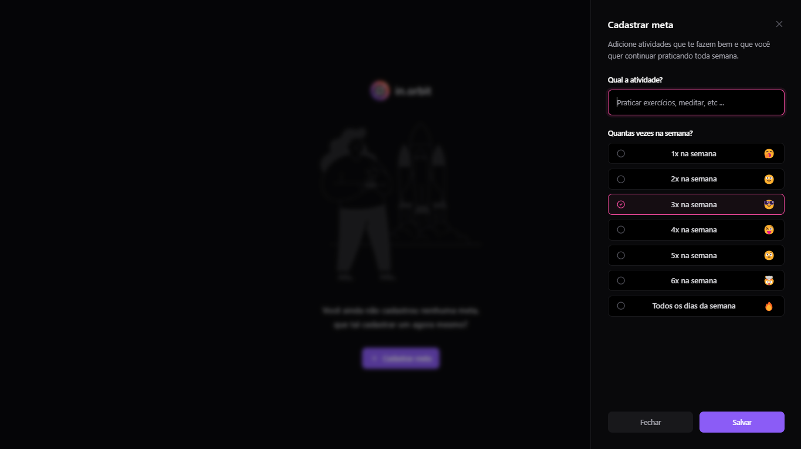
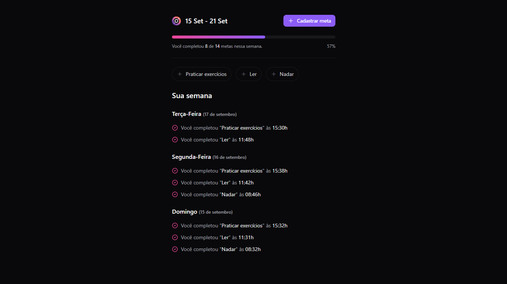

#  in.orbit

**in.orbit** é um sistema de controle de metas semanal. Com ele, você pode adicionar metas a serem cumpridas ao longo da semana, definir quantos dias deseja alcançar a meta e selecionar as metas que já foram cumpridas. Ao final da semana, o sistema gera um relatório detalhado com todas as metas concluídas, incluindo os respectivos dias e horários em que foram realizadas.

## Screenshots

<div align="center">
  
  
  
</div>


## Funcionalidades

- 📝 **Adicionar Metas**: Crie metas semanais com detalhes sobre os dias em que deseja cumpri-las.
- 📅 **Definir Dias**: Escolha em quantos e quais dias da semana você deseja cumprir cada meta.
- ✅ **Marcar Metas Cumpridas**: Selecione as metas que já foram realizadas ao longo da semana.
- 📊 **Relatório Semanal**: Veja um relatório detalhado de todas as metas cumpridas, com dias e horários de conclusão.

## 🛠️ Tecnologias Utilizadas

### Backend
- 🟢 **[Node.js](https://nodejs.org/)**: Plataforma JavaScript utilizada para construir o servidor.
- 🟦 **[TypeScript](https://www.typescriptlang.org/)**: Superconjunto do JavaScript que adiciona tipagem estática opcional.
- ⚡ **[Fastify](https://www.fastify.io/)**: Framework web para Node.js, focado em alta performance e baixo overhead.
- 🐳 **[Docker Compose](https://docs.docker.com/compose/)**: Ferramenta para configurar e executar múltiplos containers Docker.
- 🛡️ **[Zod](https://zod.dev/)**: Biblioteca para validação de esquemas de dados e validações runtime.
- 🗄️ **[Drizzle ORM](https://orm.drizzle.team/)**: ORM leve e focado em performance.
- 🐘 **[Postgres](https://www.postgresql.org/)**: Banco de dados relacional utilizado para armazenamento de dados.
- 🆔 **[@paralleldrive/cuid2](https://github.com/paralleldrive/cuid2)**: Biblioteca para geração de IDs únicos de forma segura.
- 📆 **[Day.js](https://day.js.org/)**: Biblioteca para manipulação e formatação de datas.
- 🔐 **[Fastify-type-provider-zod](https://github.com/fastify/fastify-type-provider-zod)**: Provedor de tipos para integração entre Fastify e Zod, garantindo validação de tipos no Fastify.
- 🌱 **[Biome](https://biomejs.dev/)**: Ferramenta de linting e formatação para garantir código limpo.

### Frontend
- ⚛️ **[React](https://reactjs.org/)**: Biblioteca JavaScript para construção de interfaces de usuário.
- ⚡ **[Vite](https://vitejs.dev/)**: Ferramenta de build rápida para desenvolvimento frontend.
- 🟦 **[TypeScript](https://www.typescriptlang.org/)**: Superconjunto de JavaScript com tipagem estática.
- 🎨 **[TailwindCSS](https://tailwindcss.com/)**: Framework CSS utilitário para estilização.
- 📡 **[React Query](https://tanstack.com/query/v3/)**: Biblioteca para gerenciamento de estados e requisições assíncronas.
- 📝 **[React Hook Form](https://react-hook-form.com/)**: Biblioteca para lidar com formulários no React.
- 🖱️ **[@radix-ui](https://www.radix-ui.com/)**: Biblioteca de componentes acessíveis e de alto desempenho para interfaces de usuário.
- 🖼️ **[Lucid React](https://www.npmjs.com/package/lucid-react)**: Biblioteca de componentes React.
- 🌱 **[Biome](https://biomejs.dev/)**: Ferramenta de linting e formatação para garantir código limpo.

## 🚀 Como Executar o Projeto

### 🖧 Backend (server)

1. Clone o repositório:

```bash
git clone https://github.com/joschonarth/in.orbit
```

2. Entre na pasta do backend do projeto:
```bash
cd server
```

3. Instale as dependências:
```bash
npm install
```

4. Execute o Docker Compose
```bash
docker compose up -d
```

5. Inicie o servidor de desenvolvimento:
```bash
npm run dev
```

6. O servidor estará rodando em `http://localhost:3333`.

### 🖥️ Frontend (web)

1. Navegue até a pasta `web`:

```bash
cd ../web
```

2. Instale as dependências:
```bash
npm install
```

3. Inicie o servidor de desenvolvimento:
```bash
npm run dev
```

4. A aplicação estará rodando em `http://localhost:5173`.